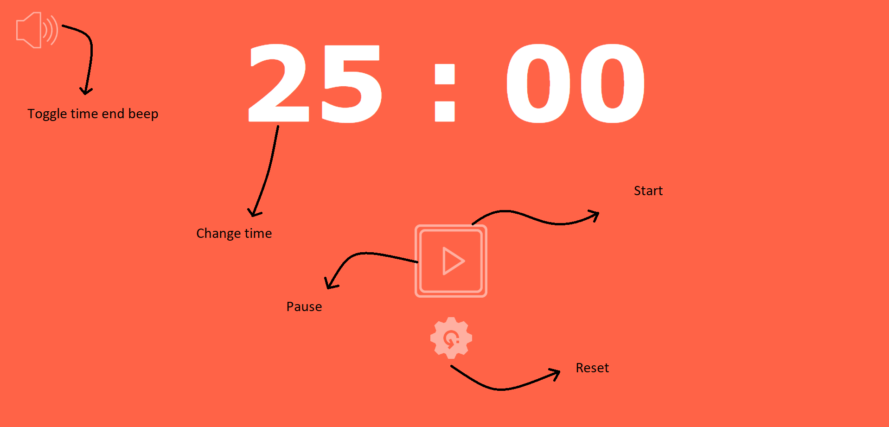

# pomodoro
Pomodoro is a time management tool

The Pomodoro Technique is a time management method developed by Francesco Cirillo in the late 1980s. The technique uses a timer to break down work into intervals, traditionally 25 minutes in length, separated by short breaks.

* Few key features:
  * You can switch time by clicking on the minutes shown.
  * You can choose to turn sound on or off for completion of timer.
  * Different sounds for different timer.
  * You can replace the *.mp3 file in sound folder with your custom sound file to play after the completion of timer.

Working Time:

Break:

